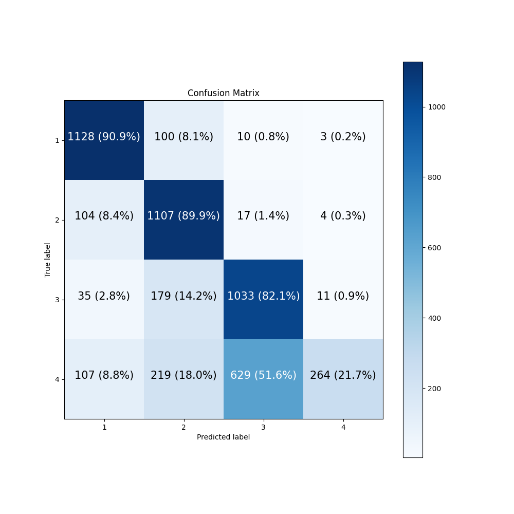

# PROJET-CODEVELLE-HERBIN

## **Binôme**
- Herbin Clément
- Codevelle Alexis

## **Sujet**
Classification de port de masque chirurgical en temps réel via un réseau de neuronnes convolutionnel avec Python, Tensorflow, Keras et OpenCV.

## **Jeu de données**
Nous utilisons un ensemble d'environ 50000 images étiquetées pris sur le site kaggle. Ces images sont des images de personnes d'âge, de sexe, d'ethni différentes.
Chaque personne à une image de chaque classe. Il y a quatres classes différentes:
- Masque bien porté.
- Masque porté en dessous du nez.
- Masque porté en dessous du menton.
- Pas de masque porté. 

## **Fichiers**
Le fichier principal est main.py.  
Le dossier **csv/** contient les fichiers csv relatifs aux différents datasets utilisés.  
Un dossier **weights/** sera créer dès le premier entraînement de modèles. Ce dossier contriendra la sauvegardes des poids des différents réseaux de neuronnes, à chaque passage sur l'ensemble des données. Par exemple, si l'on entraîne pour la première fois le modèle TinyVGG, nous aurons un dossier **weights/TinyVGG/0/**.  
Un dossier **save_model/** qui va sauvegarder un model dans l'état actuel. Par exemple **save_model/TinyVGG**.  
Un dossier **images/** qui contient les courbes de l'entraînement ainsi que les matrices de confusions.
Un dossier **dataset/** est créer, et contient 4 différents dossier:
- Un dossier **dataset/csv/**, qui contient 3 fichiers csv qui contient la liste des images des différents dossier.
- Un dossier **dataset/train/**, qui contient toutes les images qui vont être utilisé pour l'entrainement des modèles.
- Un dossier **dataset/test/**, qui contient toutes les images qui vont être testé au long de l'apprentissage.  
- Un dossier **dataset/validation/**, qui contient toutes les images qui vont servir à générer la matrice de confusion pour voir les résultats obtenu d'un modèle.  

Un dossier **lib/** qui contient les fichiers python:
- **lib/Model/** contient les différents modèles.
- **lib/video_capture/** contient les fichiers requies pour la capture d'image.
- **lib/Data_processing.py** est un fichier qui gère la mise en place des datasets.
- **lib/Data_visualisation.py** est un fichier qui permet de visualiser les résultats ou les données.
- **lib/resize_image.py** est un fichier qui permet de redimensionner les images.


## **Résultats**
Nous avons utilisé 3 modèles différents:
- TinyVGG
- Conv4Pool
- VGG19 avec du Transfert Learning
### **TinyVGG**

  <br/>
Nous pouvons voir que ce modèle à des difficultés à différencier un masque en dessous du visage et pas de masque.

### **Conv4Pool**

  <br/>
Nous pouvons voir que ce modèle à toujours des difficultés à différencier un masque en dessous du visage et pas de masque, mais fonctionne beaucoup mieux que le précédent.

### **TL_VGG19**

  <br/>
Nous pouvons voir que ce modèle à aussi des difficultés à différencier un masque en dessous du visage et pas de masque.

## Pour tester
Pour tester le programme, vous pouvez faire:
```bash
python3 main.py -lm -T # Charge le modèle TinyVGG et lance la caméra
python3 main.py -lm -C # Charge le modèle Conv4Pool et lance la caméra
```

Le modèle VGG19 ne pourras pas être utilisé étant donné que le fichier des poids est trop volumineux pour l'archive.

### Sources
- https://www.kaggle.com/tapakah68/medical-masks-part1/
- https://www.kaggle.com/tapakah68/medical-masks-part7
- https://github.com/jorcus/Computer-Vision-A-Z
- https://www.tensorflow.org/api_docs/python/tf
- https://medium.com/artificialis/get-started-with-computer-vision-by-building-a-digit-recognition-model-with-tensorflow-b2216823b90a